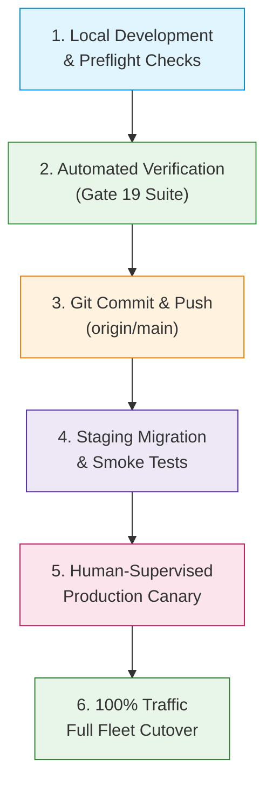

# Production Release Guide & Deployment Runbook

**DBERT Internship & Learning Portal (`Internshipportal4`)**  
**Document Reference**: `docs/PRODUCTION_RELEASE_GUIDE.md`  
**Master Plan Alignment**: Phase 27, §54 (Release Process), §55 (Production Canary), §64 (Release Blockers), Gate 19  
**Version**: 1.0.0 (Production Candidate)  
**Effective Date**: September 2026  

---

## 1. Executive Summary & Policy

### 1.1 Non-Negotiable Release Policy
1. **Human-Controlled Production Deployment (§55)**:
   The local AI agent **MUST NOT** perform automated production deployments or direct production database modifications. The agent's responsibility is strictly to prepare verified release artifacts, automated verification suites, staging dry-runs, and runbooks.
2. **Repository Target Enforcement**:
   All development, feature commits, and tags are committed and pushed strictly to the designated repository remote (`origin/main` -> `https://github.com/ainabhinavsharma/Internshipportal4.git`). Upstream organization remotes are disabled for write access.
3. **Zero-Blocker Invariant (§64)**:
   A production release cannot proceed if any of the **16 Release Blockers** defined in Section 5 are triggered. Gate 19 requires 100% automated test pass rate, 0 critical security issues, 0 data anomalies, and verified rollback capability.

---

## 2. Release Architecture & Pipeline Overview

The release pipeline progresses through five strictly isolated stages:



---

## 3. Four-Pillar Pre-Release Checklist (§54)

Every candidate release must pass verification across all four structural pillars before human sign-off:

### Pillar 1: Backend Verification
- [ ] **Unit & Modular Service Tests**:
  All 12+ modular services (`auth_service`, `application_service`, `enrollment_service`, `razorpay_client`, `outbox_service`, `file_security_service`, `privacy_service`, `ux_audit_service`, `accessibility_service`, `performance_service`, `integrity_service`, `learning/*`) pass 100% of unit tests.
- [ ] **Integration & State Machine Tests**:
  Strict state transitions verified for applications (`Draft` -> `Under Review` -> `Selected` -> `Enrollment Pending` -> `Accepted` / `Rejected`) and enrollments (`Pending Verification` -> `Accepted` / `Rejected`). No direct SQL status updates bypass state machine logic.
- [ ] **Database Abstraction & Adapter Layer**:
  SQLiteAdapter and PostgreSQLAdapter pass parity tests (`tests/test_database_abstraction.py`). Zero PostgreSQL dialect leaks in SQL queries.
- [ ] **PostgreSQL Staging Schema Compatibility (Gate 18)**:
  `python scripts/verify_postgres_compatibility.py` passes with 0 syntax or keyword errors, 65 canonical tables, and 79 indexes verified against `docs/POSTGRES_SCHEMA.sql`.
- [ ] **Security Audits**:
  - `bandit -c bandit.yaml -r app.py services/ routes/ scripts/` reports 0 High and 0 Medium vulnerabilities.
  - `pip-audit` reports 0 known CVEs across all installed production packages.
  - `verify_env_safety.py` confirms 0 tracked secrets, 0 database files in Git, and proper `.gitignore` enforcement.

### Pillar 2: Frontend Verification
- [ ] **Multi-Viewport Responsive Verification**:
  All 6 critical viewports tested without horizontal overflow, text clipping, or overlapping controls:
  - Mobile Small: 360 x 800 (Android)
  - Mobile Medium: 390 x 844 (iPhone 12/13/14)
  - Mobile Large: 412 x 915 (Pixel 7)
  - Tablet Portrait: 768 x 1024 (iPad)
  - Desktop Standard: 1366 x 768
  - Desktop Wide: 1920 x 1080
- [ ] **Touch Target & Accessibility (WCAG 2.1 AA)**:
  - Minimum touch targets (>= 44x44px or 48x48px on primary CTAs).
  - High-contrast visual focus rings (`:focus-visible`) on all interactive buttons, links, and form fields.
  - Visible labels and `aria-label` / `aria-labelledby` on all inputs.
  - Skip navigation link (`Skip to main content`) present on all pages.
- [ ] **Zero Console Errors**:
  Browser console error logs clean across public listings, authentication flows, candidate portal, and admin dashboard.

### Pillar 3: Business Workflows (Gate 19 Final UAT)
- [ ] **1. Visitor & Discovery**: Public discovery of homepage, `/jobs`, and `/internships` renders without authentication.
- [ ] **2. Signup & Account Creation**: New candidate registers, password hashed via bcrypt/Argon2, session cookie set with `HttpOnly; SameSite=Lax`.
- [ ] **3. Application Submission**: Candidate fills statement of purpose and requirements; state machine places application into `Under Review`.
- [ ] **4. Staff/Admin Selection**: Staff or Admin reviews submission and selects candidate; status moves to `Selected`, unlocking payment step.
- [ ] **5. Cohort Enrollment**: Candidate selects valid cohort Monday start date and submits enrollment details.
- [ ] **6. Payment Verification & Idempotency**: Payment confirmed (via Razorpay webhook or manual receipt verification); idempotent handling prevents double-credit; application advances to `Accepted`.
- [ ] **7. Guided Learning 2.0 Engine**: Candidate accesses domain course; submits learning turn; structured evaluation updates mastery; spaced review schedule generated.
- [ ] **8. Task Submission & Coin Rewards**: Candidate submits capstone solution; mentor approves; coins awarded to intern profile.
- [ ] **9. Certificate Issuance & Verification**: Certificate minted into `intern_certificates`; public verification endpoint `/portal/certificate/<cert_id>` confirms authenticity for external verifiers; invalid cert returns 404.

### Pillar 4: Infrastructure & Operations
- [ ] **WAL-Safe Database Backup**:
  Pre-release backup generated using `python scripts/backup_db.py --reason pre-release`.
- [ ] **Backup Verification & Checksum**:
  PRAGMA integrity check returns `ok`; SHA-256 companion file verified; entry recorded in `backups/backup_manifest.json`.
- [ ] **System Health Probes**:
  - `/health` returns HTTP 200 with database connectivity and WAL status.
  - `/ready` returns HTTP 200 with schema and table readiness.
  - `/admin/integrity-dashboard` returns HTTP 200 with 100% integrity score and 0 critical anomalies.
- [ ] **Rollback Plan Rehearsal**:
  Rollback procedure verified according to `docs/ROLLBACK_PLAN.md` with explicit database restoration checkpoints.

---

## 4. Release Blockers Checklist (§64)

The release engineer must verify that **NONE** of the following 16 conditions exist. If any blocker is detected, the release is **IMMEDIATELY ABORTED**:

| # | Blocker Criterion | Verification Method | Status |
|---|-------------------|---------------------|--------|
| 1 | **Data Loss** | `check_data_integrity.py` & row count diff between pre/post migration | **ZERO TOLERANCE** |
| 2 | **Authentication Bypass** | Multi-role auth regression suite (`test_auth_regression.py`) | **ZERO TOLERANCE** |
| 3 | **Authorization Bypass (IDOR)** | Cross-tenant authorization suite (`test_idor_matrix.py`) | **ZERO TOLERANCE** |
| 4 | **Payment Inconsistency** | Enrollment payment reconciliation & order status checks | **ZERO TOLERANCE** |
| 5 | **Duplicate Financial Credit** | Webhook idempotency test (`test_razorpay_integration.py`) | **ZERO TOLERANCE** |
| 6 | **Broken Application Lifecycle** | State machine transition test (`test_application_state_machine.py`) | **ZERO TOLERANCE** |
| 7 | **Broken Enrollment Lifecycle** | Enrollment state transition test (`test_enrollment_state_machine.py`) | **ZERO TOLERANCE** |
| 8 | **Private Data Exposure** | Privacy serializer test (`test_privacy_field_classification.py`) | **ZERO TOLERANCE** |
| 9 | **Golden Applicant Journey Failure** | E2E lifecycle test (`test_golden_journey.py` & `test_final_uat.py`) | **ZERO TOLERANCE** |
| 10 | **Database Migration Failure** | Schema compatibility check (`verify_postgres_compatibility.py`) | **ZERO TOLERANCE** |
| 11 | **Backup Failure** | Pre-release backup script execution (`backup_db.py`) | **ZERO TOLERANCE** |
| 12 | **Rollback Failure** | Verified backup manifest entry & restore test | **ZERO TOLERANCE** |
| 13 | **Critical 500 Unhandled Error** | UX dead-end & error handler suite (`test_ux_dead_ends.py`) | **ZERO TOLERANCE** |
| 14 | **Critical Security Vulnerability** | Security audit suite (`audit_security.py` Bandit + Pip-Audit) | **ZERO TOLERANCE** |
| 15 | **Guided Learning Learner-Data Corruption** | Learner simulation suite (`test_synthetic_learners.py`) | **ZERO TOLERANCE** |
| 16 | **Guided Learning Nondeterministic Mutation** | Turn idempotency and deterministic mastery policy tests | **ZERO TOLERANCE** |

---

## 5. Human-Supervised Canary Deployment SOP (§55)

```text
[Local Machine]
       ↓ (100% tests pass, Gate 19 script PASS)
[origin/main GitHub]
       ↓ (CI pipeline automated build & scans)
[Staging Environment]
       ↓ (PostgreSQL migration dry-run + E2E smoke)
[Canary Deployment (5% → 25% → 50% → 100%)]
       ↓ (Human-monitored telemetry & error budgets)
[Production Fleet 100%]
```

### Phase 0: Staging Pre-Deployment Smoke (T-60 minutes)
1. Deploy release candidate branch to staging server.
2. Run database migration dry-run:
   ```bash
   python scripts/verify_postgres_compatibility.py
   python scripts/check_data_integrity.py
   ```
3. Execute staging smoke tests against all 9 business flows.
4. Verify `/health` and `/ready` return status `200`.

### Phase 1: Canary 5% Traffic (T-30 minutes)
1. Route 5% of incoming user requests to the new release candidate pod/instance.
2. Monitor real-time metrics for **15 minutes**:
   - **p95 Latency**: Must remain < 500ms (`X-Request-Duration-Ms`).
   - **5xx Error Rate**: Must remain < 0.05%.
   - **Telemetry Dashboard**: Inspect error buckets via `telemetry_service`.
3. If any alert triggers: Execute immediate Phase 1 abort (route 100% back to baseline).

### Phase 2: Canary 25% Traffic (T-15 minutes)
1. Increase traffic allocation to 25%.
2. Soak for **15 minutes**.
3. Inspect `/admin/integrity-dashboard`:
   - Integrity Score must remain **100%**.
   - Anomaly counts must remain **0**.
4. Test a live payment and learning turn on canary instance.

### Phase 3: Canary 50% Traffic (T-5 minutes)
1. Increase traffic allocation to 50%.
2. Soak for **10 minutes**.
3. Verify background outbox event worker latency:
   - Outbox queue drain time < 5 seconds.
   - Dead-letter queue count = 0.

### Phase 4: Full Fleet Cutover (100% Traffic)
1. Promote release candidate to 100% traffic across all instances.
2. Final operational sign-off:
   - Admin logs into `/admin/integrity-dashboard`.
   - Confirm active user count, enrollment metrics, and system probe indicators green.

---

## 6. Rollback Procedures & Incident Response

### 6.1 Rollback Triggers
An immediate rollback is mandatory if during any phase of canary or post-release:
- Error rate exceeds **0.1%** for more than 2 consecutive minutes.
- Latency p95 exceeds **1000ms** sustained.
- A critical 500 error occurs in payment or enrollment flows.
- Data integrity scan reveals any orphaned records or impossible state transitions.

### 6.2 Rollback SOP Steps
1. **Traffic Reversion (Instant)**:
   Switch load balancer / ingress weights: 100% to previous stable deployment.
   ```bash
   # Revert ingress routing to stable target
   kubectl rollout undo deployment/dbert-portal
   # Or switch reverse-proxy upstream to stable blue instance
   ```
2. **Database Restoration (If Migrations Mutated Data)**:
   Locate pre-release backup in `backups/backup_manifest.json`:
   ```bash
   python scripts/verify_backup_restore.py --restore-from backups/dbert_YYYY_MM_DD_HH_MM_SS.db
   ```
3. **Outbox Drain & Event Resync**:
   Re-queue any pending transactional events that were queued during the rollback window.
4. **Post-Incident Assessment**:
   Capture telemetry snapshot, logs, and state history before restarting investigation.

---

## 7. Operational Sign-Off Template

```text
RELEASE CANDIDATE: v1.0.0-rc1
GIT COMMIT SHA:    ____________________
RELEASE ENGINEER:  ____________________
DATE & TIME:       2026-09-25 18:30 IST

[ ] Gate 19 Automated UAT Passed (tests/e2e/test_final_uat.py)
[ ] Release Readiness Script Passed (scripts/verify_release_readiness.py)
[ ] PostgreSQL Staging Migration Compatible (docs/POSTGRES_SCHEMA.sql)
[ ] Pre-release Backup Created & Verified (PRAGMA integrity_check OK)
[ ] 16 Release Blockers Verified Clean (0 detected)
[ ] Canary Phase 1 (5%) Completed without errors
[ ] Canary Phase 2 (25%) Completed without errors
[ ] Full Fleet Cutover (100%) Approved

Lead Engineer Signature: _______________________
```
